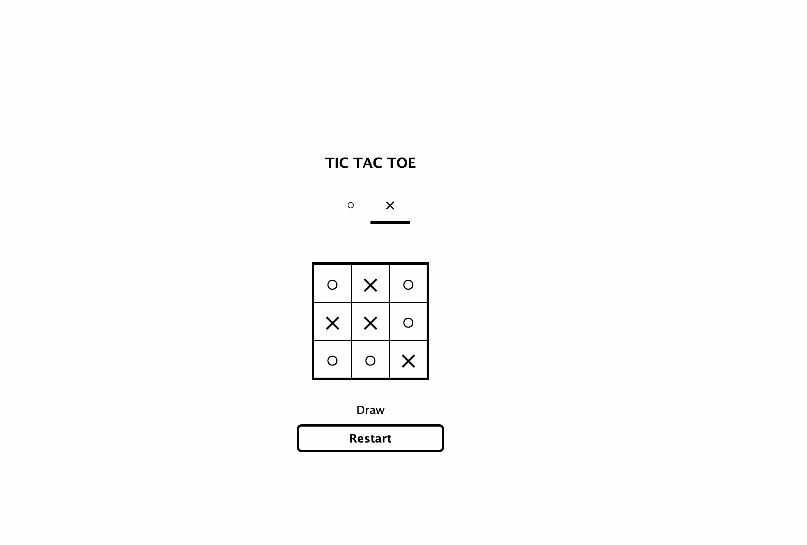

# Reactで作成　○✖︎ゲーム

昔懐かしい○✖︎ゲームをReactの学習用で実装しました。

demo: https://tatsuya1981.github.io/react-tic-tac-toe/

## 身に着けること

- Propsとは？
- Stateとは？
- children, fragment
- 関数コンポーネント
- Hoos API を使った状態管理
- コンポーネントを作る時に考えること
- yarnモジュールのインストール（styled-components)
- CSS in JS(Styled-Component)

### メインコンセプト部分中心

- [React.js公式](https://ja.react.dev/learn)

### 参考リンク
- [JavaScriptでイミュータブルなプログラミングをする](https://sbfl.net/blog/2018/09/25/javascript-immutable-programming/)
- [ES2015のモジュール機能(import/export)](https://qiita.com/ozaki25/items/9723cb3c1c72845157d5)

jsFiddle

[jsFiddle](https://jsfiddle.net/boilerplate/react-jsx)
